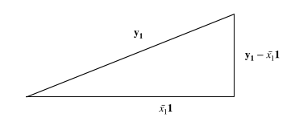
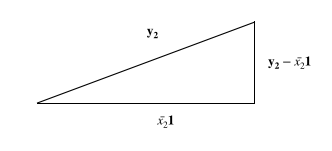
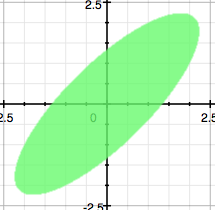
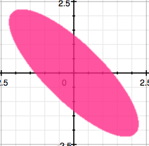
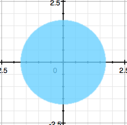

```{r message=FALSE, echo=FALSE}
library(magrittr)
library(tidyverse)
```

1. Considere los siguientes datos, correspondientes a salarios y registro final de equipos de la liga de beisbol.

```{r}
beisbol <- data_frame(equipo = c('Phillies de Filadelfia', 'Piratas de Pittsburgh',
                      'Cardenales de San Luis', 'Cubs de Chicago',
                      'Expos de Montreal', 'Mets de Nueva York'),
           nomina = c(349700,2485475,1782875,1725450,1645575,1469800),
           porcentaje_ganados = c(0.623, 0.593, 0.512, 0.5, 0.463, 0.395))
```

a. Encuentre la proyección sobre $\mathbf{1}^\top$
```{r}

nomina <- beisbol$nomina
proy_nomina <- rep(mean(nomina), 6)

proy_nomina

```

b. Calcula el vector desviación $\mathbf{d_1}=\mathbf{y_1}-\bar{x_1}\mathbf{1}$ y relaciona su longitud a la desviación estándar.

En el cociente de abajo verificamos numéricamente que $n \hat{\sigma}^2_{MV} = \|d_1\|_2^2$ (el 5 es porque `R` utiliza
el estimador insesgado, no el de máxima verosimilitud.)

```{r}
d1 <- nomina - mean(nomina)
d1

sd(nomina)^2*5/sum(d1^2)
```

c. Grafique (a escala) el triángulo formado por $\mathbf{y_1}$, $\bar{x_1}\mathbf{1}$
y $\mathbf{y_1} - \bar{x_1}\mathbf{1}$.

```{r}

normas <- c('y1'=sqrt(sum(nomina^2)),
            'x1bar'= sqrt(sum(proy_nomina^2)),
            'd1'=sqrt(sum(d1^2)))
normas/max(normas)

```



d. Repita los  incisos (a) a (c) para la otra variable.
```{r}
porcentaje_ganados <- beisbol$porcentaje_ganados
proy_pgan <- rep(mean(porcentaje_ganados, 6))

proy_pgan

d2 <- porcentaje_ganados - mean(porcentaje_ganados)
d2
sd(porcentaje_ganados)^2*5/sum(d2^2)

normas <- c('y2'=sqrt(sum(porcentaje_ganados^2)),
            'x2bar'=sqrt(proy_pgan^2),
            'd2'=sqrt(sum(d2^2)))
normas/max(normas)
```



e. Grafique los dos vectores $\mathbf{y_i} -\bar{x_i}$ y calcula el ángulo entre ellos.

Calculamos también las dos normas para mantener una proporción en la proyección. 
```{r}
sqrt(sum(d1^2))
sqrt(sum(d2^2))
theta <- acos(sum(d1*d2)/sum(d1^2)*sum(d2^2))*180/pi
theta
```

Por el ángulo entre ellos notamos que son ortogonales, pero en su verdadera escala no se distinguiría la diferencia, así que 
no lo dibujaremos.


f. Calcule la varianza muestral generalizada e interprete el resultado.
```{r}
S <- cov(select(beisbol, 2:3))
det(S)
eigen(S)
```

Notamos por los vectores propios que los ejes del elipse que engloba a los datos son casi los ejes canónicos 
(el error es tan pequeño que hasta podría ser numérico).
Además, por los valores propios vemos que en la dirección de $\mathbf{y_1}$ la varianza es mucho mayor. Sin 
embargo, la escala también es mucho mayor.


f. Calcule la varianza total muestral e interprete el resultado.
```{r}
sum(eigen(S)$values)
```

La varianza total casi coincide con la varianza en la dirección de $\mathbf{y_1}$, lo cual otra vez se
explica porque en la otra es muy poca. 

```{r echo=FALSE}
rm(list=ls())
```

2. Dibuje las elipsoides sólidas 
$\{\mathbf{x} \colon \mathbf{(x-\bar{x})^\top S^{-1}(x-\bar{x})} \leq 1\}$
para las tres matrices siguientes y determine los valores de los ejes mayores y menores.

Notemos primero que por ser $S$ simétrica y positiva definida, $S^{-1}$ también es positiva definida y
$\{\mathbf{x} \colon \mathbf{(x-\bar{x})^\top S^{-1}(x-\bar{x})} \leq 1\}$ es la bola unitaria y centrada
en cero de la norma inducida por el producto interno $\mathbf{x}^TS^{-1}\mathbf{x}$. Entonces, podemos
ignorar el valor de y usar 0, $\mathbf{\bar{x}}$, pues en cualquier espacio normado, 
$B_r(\mathbf{x}) = rB_1(\mathbf{0}) + \mathbf{x}$.

a. $S = \begin{pmatrix} 5 && 4 \\ 4 && 5 \end{pmatrix}$



```{r}
S <- matrix(c(5, 4, 4, 5), ncol=2, nrow=2)
Sinv <- solve(S)

lambdas <- eigen(Sinv)$values
veps <- eigen(Sinv)$vectors
```

Los ejes van en las direcciones de, leído por columnas,
```{r}
veps
```

Y las correspondientes longitudes son
```{r}
1/sqrt(lambdas)
```

b. $S = \begin{pmatrix} 5 && -4 \\ -4 && 5 \end{pmatrix}$



```{r}
S <- matrix(c(5, -4, -4, 5), ncol=2, nrow=2)
Sinv <- solve(S)

lambdas <- eigen(Sinv)$values
veps <- eigen(Sinv)$vectors
```

Los ejes van en las direcciones de, leído por columnas,
```{r}
veps
```

Y las correspondientes longitudes son
```{r}
1/sqrt(lambdas)
```

c. $S = \begin{pmatrix} 3 && 0 \\ 0 && 3 \end{pmatrix}$



```{r}
S <- matrix(c(3, 0, 0, 3), ncol=2, nrow=2)
Sinv <- solve(S)

lambdas <- eigen(Sinv)$values
veps <- eigen(Sinv)$vectors
```

Los ejes van en las direcciones de, leído por columnas,
```{r}
veps
```

Y las correspondientes longitudes son
```{r}
1/sqrt(lambdas)
```

3. El archivo `INEGIConstruccion2017.csv` en la página de Piazza contiene datos de 
2017 de la Encuesta Mensual sobre construcción que lleva a cabo el INEGI cada mes en
los diferentes estados de la República. El archivo contiene, para cada estado y cada
mes de 2017, las siguientes variables:

- $X_1$: Total de horas trabajadas (Miles de horas)
- $X_2$: Valor total de producción generado en la entidad por tipo de obra ($ en 
términos reales)
- $X_3$: Total de horas trabajadas Dependiente (Miles de horas) 
- $X_4$: Obreros Dependiente
- $X_5$: Empleados Dependiente
- $X_6$: Propietarios, familiares y otros Dependiente
- $X_7$: Total de horas trabajadas No dependiente (Miles de horas)

Para este ejercicio consideraremos $\mathbf{X}$ la matriz donde los estados son las 
unidades experimentales, y las variables son las listadas sólo para enero de 2017.

a. Configura la matriz $\mathbf{X}$ para poder operar con ella.
```{r echo = FALSE}
rm(list=ls())
```

El siguiente comando de bash intenta convertirlo a UTF-8, saltándose los 
caracteres que no funcionan.
`iconv -c -t UTF-8 ./data/INEGIConstruccion2017.csv > ./data/newnegi.csv`


```{r message=FALSE}
inegi <- read_csv('./data/newnegi.csv',
                  skip=1,
                  n_max=12,)
```

La tabla está en formato ancho, hay que pasarla a largo, pero necesitamos
entender las columnas. La primera es el periodo (año y mes), pero falta entender las 
demás. Por ahora voy a ignorar periodo.
```{r}
inegi_names <- names(inegi) %>%
  str_split('>')
inegi_names <- inegi_names[2:215]

new_names <- rep(NA, 214)

# Revisa si todas las columnas tienen la misma primera componente
# en el nombre.
revisar_redundancia <- function(slots){
  cadena_propuesta = slots[[1]][1]
  
  slots %>%
    map(function(x) x[1] == cadena_propuesta) %>%
    unlist() %>%
    all()
}

# Borra columnas irrelevantes 
borrar_innecesario <- function(slots){
  slots %>%
    map(function(x) x[2:length(x)])
}

while(revisar_redundancia(inegi_names)){
  inegi_names <- borrar_innecesario(inegi_names)
}

# ¿Qué cosas diferentes hay en la primera columna?
inegi_names %>%
  map(function(x) x[1]) %>%
  unique()
```

Acabamos de lograr dos cosas. Primero, quitar las partes innecesarias de los nombres
para hacer más fácil entenderlos y procesarlos. La segunda, notamos que la separación
a partir del tercer nivel se debe a dos vertientes. Nos encargamos ahora de la
segunda.
```{r}
idxs_valor <- inegi_names %>%
  map(function(x) x[1] == ' Valor de produccin generado en la entidad ') %>%
  unlist()

names_valor <- inegi_names[idxs_valor]

while(revisar_redundancia(names_valor)){
  names_valor <- borrar_innecesario(names_valor)
}

names_valor <- names_valor %>%
  str_match('[^(]*') %>%
  str_match('(?<=Total ).*$') %>%
  as.character() %>%
  tolower() %>%
  str_replace_all(' ', '_')
names_valor <- paste('valor_total', names_valor, sep='_')
new_names[idxs_valor] <- names_valor

```

Ahora vamos con los que empezaban con horas trabajadas.
```{r}
idxs_hrs <- inegi_names %>%
  map(function(x) x[1] == ' Horas trabajadas ') %>%
  unlist()

names_horas_trabajadas <- inegi_names[idxs_hrs] %>%
  borrar_innecesario()
```

Aquí a simple vista hay tres categorías: totales, dependientes y no dependientes.
Vamos primero a trabajar los totales.

```{r}
subidx_horas_totales <- names_horas_trabajadas %>%
  map(function(x) length(x)==1 && str_sub(x, 1, 7) == ' Total ') %>%
  unlist()
subnames_horas_totales <- names_horas_trabajadas[subidx_horas_totales] %>%
  unlist() %>% #Sabemos que todo es de longitud 1, por la condición anterior.
  str_match('[^(]*') %>%
  str_match('(?<=Total ).*$') %>%
  tolower() %>%
  str_replace_all(' ', '_')
subnames_horas_totales <- paste('horas_totales', subnames_horas_totales, sep='_')
names_horas_trabajadas[subidx_horas_totales] <- subnames_horas_totales
```

Ahora vamos con los que empezaban por dependiente.
```{r}
subidx_horas_dependiente <- names_horas_trabajadas %>%
  map(function(x) length(x)==2 && x[[1]]==' Dependiente ') %>%
  unlist()
subnames_horas_dependiente <- names_horas_trabajadas[subidx_horas_dependiente] %>%
  borrar_innecesario() %>%
  tolower() %>%
  str_trim() %>%
  str_replace_all(' ', '_') %>%
  str_match('[^(]*') %>%
  as.character()

subnames_horas_dependiente <- 
  paste('dependiente', subnames_horas_dependiente, sep='_')
names_horas_trabajadas[subidx_horas_dependiente] <-
  subnames_horas_dependiente
```

Finalmente, vamos por los no dependientes.
```{r}
subidx_no_dependientes <- names_horas_trabajadas %>%
  map(function(x) length(x)==1 && str_sub(x, 1, 4) == ' No ') %>%
  unlist()

subnames_no_dependientes <- names_horas_trabajadas[subidx_no_dependientes] %>%
  str_trim() %>%
  str_match('[^(]*') %>%
  unlist() %>%
  tolower() %>%
  str_replace_all(' ', '_')
  
names_horas_trabajadas[subidx_no_dependientes] <- subnames_no_dependientes
```

Y para este punto, tengo ya los nombres de todo lo que empezaba con horas trabajadas
y puedo reconstruir los nombres de todas las columnas como debe ser.
```{r}
names_horas_trabajadas <- unlist(names_horas_trabajadas)
new_names[idxs_hrs] <- names_horas_trabajadas

# Recordando que ignoramos el periodo
names(inegi) <- c('periodo', new_names)
```

En este *chunk* cambiamos el periodo por mes, porque el año es redundante.
```{r}
inegi <- inegi %>%
  mutate(mes = as.integer(str_sub(periodo, 6, 7))) %>%
  select(mes, everything(), -periodo)
```

Y ahora sí lo pasamos a formato largo usando `gather`. Primero voy a definir
funciones que detecten el estado en cada uno de los posible casos, para 
facilitar el `gather` más adelante.
```{r}
# Esto me funciona como diccionario
claves <- c('ht', 'vt', 'nd', 'dt', 'do', 'de', 'dp')
names(claves) <- c('horas_totales_',
                   'valor_total_',
                   'no_dependiente_',
                   'dependiente_total_',
                   'dependiente_obreros_',
                   'dependiente_empleados_',
                   'dependiente_propietarios,_familiares_y_otros_trabajadores_no_remunerados_')

# Busca el estado según cada uno de los 7 casos con expresiones regulares.
extraer_estado <- function(nombre, clave){
  por_quitar <- names(claves[claves==clave])
  rgx <- paste('(?<=', por_quitar, ').*$', sep='')
  str_extract(nombre, rgx)
}

# Subcasos para lo que empieza con 'dependiente'
f_dep <- function(nombre){
  li <- str_sub(nombre, 13, 13)
  ifelse(li=='t', extraer_estado(nombre, 'dt'),
         ifelse(li=='o',extraer_estado(nombre, 'do'),
                ifelse(li=='e', extraer_estado(nombre, 'de'), 
                       extraer_estado(nombre, 'dp'))))
}

# De aquí empiezo a detectar qué caso es.
detectar_estado <- function(nombre){
  pl <- str_sub(nombre,1,1)
  ifelse(pl=='h', extraer_estado(nombre, 'ht'),
         ifelse(pl=='v', extraer_estado(nombre, 'vt'),
                ifelse(pl=='n', extraer_estado(nombre, 'nd'), f_dep(nombre))))
}

# Y esto es para quitar el estado después
g_dep <- function(nombre){
  li <- str_sub(nombre, 13, 13)
  ifelse(li=='t', 'total_dependiente',
         ifelse(li=='o','obreros_dependiente',
                ifelse(li=='e', 'empleados_dependiente', 
                       'otros_dependiente')))
}
detectar_medida <- function(nombre){
    pl <- str_sub(nombre,1,1)
  ifelse(pl=='h', 'horas_totales',
         ifelse(pl=='v', 'valor_total',
                ifelse(pl=='n', 'no_dependientes', g_dep(nombre))))
}
```

Y con estas funciones, se vuelve sencillo pasar los datos a formato largo.
```{r}
inegi <- inegi %>%
  gather(key=medida, value=valor, -mes) %>%
  mutate(estado = detectar_estado(medida),
         medida = detectar_medida(medida)) %>%
  spread(medida, valor) %>%
  select(estado, mes, horas_totales, 
         valor_total,  total_dependiente, obreros_dependiente, 
         empleados_dependiente, otros_dependiente,no_dependientes)
```

Finalmente, sólo queremos los datos de enero.
```{r}
enero <- inegi %>%
  filter(mes==1) %>%
  filter(estado!='total_nacional')

enero
```


b. Calcula su media y covarianza.
```{r}
X_barra <- enero %>%
  select(3:9) %>%
  summarise_all(function(x) mean(x, na.rm=T))

X_barra

S_obs_completas <- enero %>%
  select(3:9) %>%
  log() %>%
  cov(use='complete.obs')

S_obs_completas
```

c. Verifique que $\det(\mathbf{S})=\prod_{i=1}^7s_i^2 \det(\mathbf{R}))$

Usando $\log$ para no overflowear:
```{r}
R_obs_completas <- enero %>%
  select(3:9) %>%
  log() %>%
  cor(use='complete.obs')

ss_comp <- diag(S_obs_completas)

det(S_obs_completas)/(prod(ss_comp)*det(R_obs_completas))
```


4. Sea $\mathbf{X} \sim \mathcal{N}_3(\mathbf{\mu, \Sigma})$, donde 
$\mathbf{\mu}^\top = (-3, 1, 4)$ y  $\mathbf{\Sigma} = \begin{pmatrix} 1 && -2 && 0 \\ -2 && 5 && 0 \\ 0 && 0 && 2 \end{pmatrix}$.
Determine si la siguientes variables son independientes y por qué.

```{r echo=FALSE}
rm(list=ls())
```

a. $X_1$ y $X_2$
No son independientes porque su covarianza es negativa.

b. $X_2$ y $X_3$
Son independientes porque, en la normal multivariada, covarianza cero implica independencia.

c. ($X_1$ , $X_2$) y $X_3$
Son independientes porque podemos particionar 
$\mathbf{\Sigma} = \begin{pmatrix} \Sigma_{11} && \Sigma_{12} \\ \Sigma_{21} && \Sigma_{22} \end{pmatrix}$ con $\Sigma_{12} = \Sigma_{21} = 0_2$, y eso basta en la normal multivariada.

d. $\frac{X_1+X_2}{2}$ y $X_3$
Notemos que $\frac{X_1+X_2}{2} = (\frac{1}{2}, \frac{1}{2},0)X$, por lo que
la covarianza de $\frac{X_1+X_2}{2}$ y $X_3$ es
$(\frac{1}{2}, \frac{1}{2},0) \mathbf{\Sigma}(\frac{1}{2}, \frac{1}{2},0)^\top$.
```{r}
sigma <- matrix(c(1, -2, 0,
                  -2, 5, 0,
                  0, 0, 2),
                ncol=3,
                nrow=3)
A <- c(1/2, 1/2, 0)

t(A) %*% sigma %*% A
```
y no son independientes.

e. $X_2$ y $X_2 - \frac{5}{2}X_1-X_3$
Por el mismo argumento anterior, calculamos
```{r}
A <- c(-5/2, 1, -1)
t(A) %*% sigma %*% A
```
y no son independientes.


5. Sea $\mathbf{X} \sim \mathcal{N}_3(\mathbf{\mu, \Sigma})$, donde 
$\mathbf{\mu}^\top = (2, -3, 1)$ y  $\mathbf{\Sigma} = \begin{pmatrix} 1 && 1 && 1 \\ 1 && 3 && 2 \\ 1 && 2 && 2 \end{pmatrix}$.

a. Encuentre la distribución de $3X_1-2X_2+X_3$.
Notemos que $3X_1-2X_2+X_3 = (3, -2,  1)X=AX$ por lo que su distribución es
$\mathcal{N}(A\mu, A \Sigma A^\top)$, donde
```{r}
sigma <- matrix(c(1,1,1,1,3,2,1,2,2), nrow=3, ncol=3)
mu <- c(2, -3, 1)

A <- c(3, -2, 1)

A%*%mu

t(A)%*%sigma%*%A

```

b. Encuentre un vector $a$ tal que $X_2$ y $Y = X_2 - a^\top (X_1, X_2)^\top$ sean
independientes.

Notemos que
\[
\begin{equation}
\begin{split}
X_2 \upvDash (X_2-a^\top X) &\Leftrightarrow X_2 \upvDash (-a_1X_1+(1-a_2)X_2) \\
& \Leftrightarrow \mathrm{cov}(X_2, -a_1X_1+(1-a_2)X_2)=0 \\
& \Leftrightarrow -a_1\mathrm{cov}(X_2, X_1) + (1-a_2)\mathrm{Var}(X_2)=0
\end{split}
\end{equation}
\]

Lo cual sucede, por ejemplo, con $a_1 = \mathrm{Var}(X_2)$ y  $a_2 = 1-\mathrm{cov}(X_2, X_1)$.


6. Considere la transformación $\mathbf{y_i} = A\mathbf{x}_i+\mathbf{b}$. 

Muestre que
a. $\mathbf{\bar{y}} = A\mathbf{\bar{x}} + \mathbf{b}$

$\mathbf{\bar{y}} = \frac{1}{n}\sum_{i=1}^n\mathbf{y}_i =\frac{1}{n}\sum_{i=1}^n(A\mathbf{x}_i+\mathbf{b}) = \frac{1}{n}\sum_{i=1}^nA\mathbf{x}_i + \frac{n}{n}\mathbf{b} = A \frac{1}{n}\sum_{i=1}^n\mathbf{x}_i + \mathbf{b} = A\mathbf{\bar{x}}+\mathbf{b}$

b. $S_y = AS_xA^\top$
Basta notar que para todos $i,j$
$\mathrm{cov}(A\mathbf{x_i}+\mathbf{b}, A\mathbf{x_j}+\mathbf{b}) = \mathrm{cov}(A\mathbf{x_i}, A\mathbf{x_j}) =  A\mathrm{cov}(\mathbf{x_i}, \mathbf{x_j})A^\top$

7. En 1947, Fisher obtuvo datos relativos al peso del cuerpo en kilogramos ($x_1$) y el peso del corazón en gramos ($x_2$) de 144 gatos. 
Para las hembras, la suma y suma de cuadrados y productos están dados por: 

\[
\mathbf{X}_1^\top\mathbf{1} = \begin{pmatrix} 110.9 \\ 432.5 \end{pmatrix} \\
\mathbf{X}_1^\top\mathbf{X}_1 = \begin{pmatrix} 110.9 \\ 432.5 \end{pmatrix}
\]

Muestre que el vector media y la matriz de covarianza están dados por

\[
\mathbf{\bar{x}} = (2.36, 9.20)^\top \\
\mathbf{S_x} = \begin{pmatrix} 836.75 & 3275.55 \\ 1029.62 & 4064.71 \end{pmatrix}
\]

Por el inciso (b), sabemos que hay 97 machos, y por lo tanto 47 hembras. Luego, observando el 
resultado de 
```{r}
hbarra <- c(110.9, 432.5)/47
hbarra
```

tenemos la media. Para la covarianza, la cuenta es

```{r}
hth <- matrix(c(265.13, 1029.62, 1029.62, 4064.71), nrow=2, ncol=2)
Sh <- hth/47-hbarra%*%t(hbarra)
Sh
```

b. Repítalo para los gatos macho.
```{r}
mbarra <- c(281.3, 1098.3)/97
mbarra

mtm <- matrix(c(836.75, 3275.55, 3275.55, 13056.17), ncol=2, nrow=2)
Sm <- mtm/97-mbarra%*%t(mbarra)
Sm
```

c. Considerando los gatos como una sola muestra, calucle la media y la covarianza.
```{r}
xbarra <- (47*hbarra + 97*mbarra)/144
xbarra

Sx <- (46*Sh + 96*Sm)/143
Sx
```

d. Calcular el coeficiente de correlación para todos los incisos anteriores.

Para las hembras:
```{r}
Dh_inv <- sqrt(diag(1/diag(Sh)))
Dh_inv%*%Sh%*%Dh_inv
```

Para los machos:
```{r}
Dm_inv <- sqrt(diag(1/diag(Sm)))
Dm_inv%*%Sm%*%Dm_inv
```

Para la conjunta:
```{r}
Dx_inv <- sqrt(diag(1/diag(Sx)))
Dx_inv%*%Sx%*%Dx_inv
```